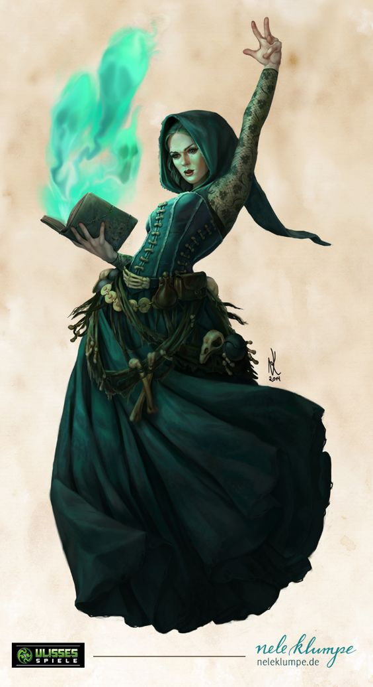

::: aside

Attribute     | Value
---------     | -----
Hit Die       | d6
HP/level      | 4
Weapon Prof.  | None
Armor Prof.   | None
Saving Throws | Con, Wis

Level | Special Ability
----- | ---------------
1     | [Witchcraft](#Witchcraft)
2     |
3     |
4     |
5     | [Felicity](#Felicity)
6     |
7     |
8     |
9     |
10    |
11    |
12    |
13    |
14    |
15    |
16    |
17    |
18    |
19    |
20    |

:::

# Witch
Witchy flavor text. Witchy flavor text. Witchy flavor text. Witchy flavor text. Witchy flavor text. Witchy flavor text. Witchy flavor text. Witchy flavor text. Witchy flavor text. Witchy flavor text. Witchy flavor text. Witchy flavor text. Witchy flavor text.

Witchy flavor text. Witchy flavor text. Witchy flavor text. Witchy flavor text. Witchy flavor text. Witchy flavor text. Witchy flavor text. Witchy flavor text. Witchy flavor text. Witchy flavor text. Witchy flavor text. Witchy flavor text. Witchy flavor text. Witchy flavor text. Witchy flavor text. Witchy flavor text. Witchy flavor text. Witchy flavor text. Witchy flavor text. Witchy flavor text. Witchy flavor text. Witchy flavor text. Witchy flavor text. Witchy flavor text.

Witchy flavor text. Witchy flavor text.

# Witchcraft
You are able to cast spells.

Spellcasting Skill
  : You gain the [Thaumaturgy](/5e/Skills/Thaumaturgy) skill (Wisdom based). This skill is used to target spells, set DCs, etc.

Spell List 
  : The list of spells you can potentially learn is given below in the [#Witch Spell List]().

Spell Knowledge 
  : You learn spells through study, and finalize that study by scribing spells in your [#Book of Secrets]().
+ You start at level 1 with 6 1st-level Witch spells of your choice.
+ Each level, you may choose 2 new spells of appropriate level (max level = your Witch level / 2, rounded up). This represents your ongoing study that occurs in the background as you adventure.
+ You may learn spells from others, whether through instruction, or by reading, comprehending, and transcribing spellbooks and spell scrolls. Rules TBD
+ You may learn a new spell by spending a [Skills#Skill Alternative]().
+ You always know all rituals of spell levels that you can cast.

Spell Slots 
  : You do not have spell slots, but rather use [#Mana]() to power your spells.
  : You have 2 Mana per level of Witch.

Cantrips 
  : You begin knowing 3 cantrips of your choice. Each time you gain new spell knowledge, you can select a cantrip instead.

# Felicity
The more you learn of witchcraft, the closer you near to true harmony with magic.

Each time you gain this ability, select one permanent benefit from the list below. You immediately gain all benefits appropriate for your current level, and when you gain more levels, you automatically gain the listed benefits for those traits you've selected.

+ [Clarity](): You perceive the flow of magic ever more clearly.
  + Level 5+: You may activate or deactivate Clarity as a free action. It grants the benefits of [http://5e.d20srd.org/srd/spells/detectMagic.htm Detect Magic] and [http://5e.d20srd.org/srd/spells/seeInvisibility.htm See Invisibility] at no Vitae cost.
  + Level 9+: When Clarity is active, you can see the true form of any creature whose form is obscured by illusion, transmutation, or magic of any kind, and your vision penetrates concealement (magical or otherwise) at up to 120 ft.
  + Level 13+: When Clarity is active, you can detect alignment at will, you understand the purpose of spells of any level, and you know exactly what spells a creature in your sight is capable of casting.
  + Level 17+: When Clarity is active, you learn the keywords and weaknesses of magic spells that you see, and your vision penetrates cover (magical or otherwise) within 120 ft.

+ [Rapture](): Using magic soothes and empowers you.
  + Level 5+: Whenever you expend Vitae, you are healed for 1 HP per point spent, and all pain is dampened for several minutes (for magical pain effects, you gain an immediate save to end).
  + Level 9+: Whenever you expend Vitae, you gain advantage to your next saving throw, attack, or skill check, within 1 rd per Vitae spent.
  + Level 13+: tbd

+ [Sympathy](): You are one with magic; spells have a difficult time hurting you.
  + Level 5+: You gain advantage to any save against magic. Additionally, any spell that can discriminate between "friend" and "foe" has a 5% chance per your Witch level to consider you a "friend" regardless of the caster's intentions.
  + Level 9+: Whenever an enemy gain a beneficial or healing effect from a targeted spell within 30 ft, you have a 5% chance per Witch level to gain the same effect. Additionally, whenever you are harmed by a spell (other than a cantrip), you gain 1 Vitae.
  + Level 13+: You gain resistance to all damage caused by magic.
  + Level 17+: Your 5%/level chances are locked to 100%. You may treat any unattended magical effect as if you were the caster (dismissing it, changing it, etc), and if it is attended, you need merely beat the caster in a Charisma check to take control of it.

+ [Defying Gravity](): Everyone finds magic to be uplifting. You take it a bit more literally.
  + Level 5+: You no longer leave tracks when you walk. You find it easier to balance on uncertain terrain, gaining advantage to such checks. You are resistant to falling damage.
  + Level 9+: Your feet don't quite touch the ground. You always have traction as if standing on dry, solid ground, and are never slowed by the likes of snow, mud, or similar terrain. You can fall any distance without suffering any falling damage. When falling, you can glide up to 10 ft horizontally in any direction you choose for each 5 ft you fall.
  + Level 13+: You can fly at the same speed as your walking speed. With the aid of a magic broom, you can double your flying speed (5x for overland flight).
  + Level 17+: ?

# Witch Spell List

## Blood

### Blood Cantrips
#### Debilitation
+ [Infection](): 1 action, touch or 60-ft, V/S, inst; you infect subject with one (if ranged) or 2 (if touch) stacks of a chosen disease. Diseases last 5 rounds; each application stacks and refreshes (max 5 stacks).
  + '''Blood Boil''': subject suffers 1d6 fire damage per round, and when struck for physical damage, causes a burst 1 inflicting 1d6 fire damage to enemies.
  + '''Frost Fever''': subject suffers 1d6 cold damage per round, and has a penalty of -1 to movement rate per stack. At 5 stacks, the subject is ''Restrained''.
  + '''Shadow Plague''': subject suffers 1d6 necrotic damage per round, and has a penalty of -1 to damage rolls per stack. At 5 stacks, the subject is [Weakened]() (half damage, or lower of 2 results given the penalty to damage rolls).
  + At level 5, you inflict +1 stacks per casting. At level 11, +2 stacks. At level 17, +3 stacks.

#### Enhancement
+ [Let Blood](): At-will, bonus; you let your own blood (using your athame), expending one or more Hit Dice (your choice), gaining 1 Mana per HD expended.

#### Utility
+ [Evoke Flame](): Free, medium range; targeted blood, freshly spilled within last 3 rounds, burst into flames, providing heat and light and igniting flammable objects as normal. Blood burns as long as you remain in long range, or until the sun rises.
  + Reversed: Free; you suffer medium physical damage, letting your blood flow, which you then cast in a short cone. Any fires in the area, natural or otherwise, are immediately quenched.

### Rank 1 Blood Spells
#### Debilitation
+ [Pestilence](): Bonus, short range; up to 5 stacks of any diseases are spread from target to chosen targets within 15 ft of subject.

#### Healing
+ [Transfusion](): Bonus, touch; you transfer your HP into subject (max 50% of your max HP). Costs 0 Vitae, but can spend 1 per 5 levels to add +5 healing. Can use offensively as a single action to drain subject's HP to heal yourself; in this case, max damage is the amount needed to heal you to full, and the Vitae cost is 1. HP in excess of max are temporary and fade after 10 minutes.

#### Healing
+ [Blood Bead](): Bonus action, 1 Vitae; you create a bead of your own blood, which hardens. At any time, as a free action, a creature can crush the bead, healing himself for 1d8 + Wis damage (+1d8 per extra Vitae spent). No creature may possess more than one bead at a time. Beads not possessed by a creature melt into liquid blood and are wasted.

### Rank 2 Blood Spells
#### Assault
+ [Blood Nova](): Single action, medium range, burst 2; inflicts fire damage to enemies equal to the number of hit points the subject is currently missing, and heals allies for half that amount.

#### Debilitation
+ [Outbreak](): Single action, touch; subject gains 5 stacks of any disease you can inflict. Alternatively, short range, 3 stacks. Cannot use in the same round as [Infection]().
+ [Hemophilia](): Bonus action, medium range; all physical damage subject suffers becomes ongoing for 3 rds. This effect lasts for 3 rounds.

#### Defense
+ [Ring of Fire](): Single action, centered circle 1-3, 3 rounds; a low ring of fire surrounds you, inscribing a pentagram. Does not block line of sight, but does block line of effect of hostile magic and projectiles. Enemies suffer 4d8 fire damage upon entering or starting turn within area.

#### Healing
+ [Death and Rebirth](): ritual, 10 minutes, reagent (1 living creature of the same type as the subject, e.g. "natural humanoid"); you sacrifice a living creature, and use its passing to resurrect a subject who has been dead for up to 1 day/level.
  + Reversed: Dead subject quickly decays into dust; in a radius around the subject, verdant life springs forth from the ground, in full bloom. Radius is based on the level of subject (10 yards for minor creatures, otherwise 100 yards per level). Optionally, subject's bones remain.

#### Defense
+ [Ironguard](): Bonus action, concentration; you become immune to metal weapons. They simply pass through you, as if they were made of nothing at all. Has no effect on wooden or glass weapons.

### Rank 3 Blood Spells
#### Mobility
+ [Create Hearthstone](): ritual, 10 minutes, reagent (a stone from the destination hearth, plus 10 gp); you create a stone which allows you to teleport to the destination hearth. A hearthstone has a 1 hour cooldown.
  + Reversed: 10 minutes, reagent (one hearthstone); you destroy the hearthstone, and the hearth to which it is meant to teleport its user, negating the function of any other hearthstones connected to it.

#### Utility
+ [Create Greater Phylactery](): ritual, 1 hour, reagent cost (1 gp plus a strong sympathetic component)####  as [Create Phylactery](), but requires the strongest of sympathetic components, such as a vial of fresh blood (no more than 5 minutes exposed at start of ritual) or a portion of subject's soul. Allows all uses of a standard phylactery, plus
  + Transmit Weal or Woe: same as normal, except phylactery can suffer 5 "hits" before being destroyed.
  + Steal Visage: same as normal, but does not destroy phylactery.
  + Steal Spell: at-will; you may cast a spell that the subject knows, as if you knew it.
  + Magnify Harm: constant; any harm you inflict upon subject directly (not through Transmit Weal or Woe) is increased in effectiveness by 50%.
  + Domination: at-will, concentration; you may control subject's actions (Contest of Wills).

#### Defense
+ [Frozen Blood](): Bonus action, concentration; your hit points cannot change, up or down. You still accumulate damage, which can be healed away (though not any damage you already had when you first cast the spell). Costs 1 Vitae per round to sustain.

## Mysticism

### Mysticism Cantrips
+ [Presence](): You alter the environment around you, causing creatures to be empowered, chilled, or unsettled. TBD
+ [Witchfire](): Bonus, concentration; your hand or a held object is immolated by heatless blue fire, which illuminates as well as a torch. The light can only be seen by your allies or those actively detecting magic.

### 1st Rank Mysticism Spells

#### Assault
+ [Mindfire](): 1 mana, ranged; medium psychic damage + wracked 1 rd (Wis half, negates wracked).

#### Control
+ [Phantasm](): Bonus, concentration, 30-ft range; you control what subject senses while you concentrate (Cha ends, but only if they realize the effect is happening; you can use Deception to fool them if your phantasm is suitably subtle).

#### Enhancement
+ [Vital Focus](): Bonus action; spend 1 or more Vitae to gain +2 per point spent to a single check or save within 1 rd.

#### Healing
+ [Pain Suppression](): Bonus action, touch; subject is mostly immune to pain, ignoring pain effects, and gaining the ability to take actions while ''disabled'' or ''dying''. Rules TBD

#### Utility
+ [http://5e.d20srd.org/srd/spells/detectThoughts.htm Detect Thoughts]: You read subject's surface thoughts (click for details).
+ [Emotion](): Single action, ranged; subject is affected by a single, powerful emotion. Choose one of the following
  + *Calm:* Subject immediately ceases all action and contemplates life. Wisdom save ends; any hostility against target ends the effect. Can also use on an ally to nullify a negative emotion effect or berserker rage.
  + *Desire:* Subject is overcome with desire for caster or another of caster's choice, undermining his judgment. Rules TBD.
  + *Fear:* Subject becomes frightened, ceasing all action but to flee and defend himself. Wisdom save ends after first round.
  + *Resolve:* Subject's will is hardened; he gains advantage to all saving throws for 1 minute.
  + *Rage:* Subject immediately becomes hostile to everyone. Wisdom save ends.
+ [Mystic Eyes](): Bonus action, concentration; you gain the ability to see outlines around all creatures within short range, regardless of invisibility, stealth, concealment, cover, or presence in the current dimension.
+ [Veil](): Bonus, concentration; you wrap yourself in illusion, becoming invisible. This requires great concentration, so if you suffer damage, or are otherwise distracted while maintaining it, you must pass a spellcasting check to avoid dropping the veil.
  + At level 5, you may spend 1 extra Mana to expand the radius by 1 square. Every 2 levels, the limit increases by another 1 mana and 1 square.

### 2nd Rank Mysticism Spells
#### Control
+ [Mind Control](): Single action, concentration, long range; you control subject's actions while he remains within Long range (Wisdom save ends, max one save per 10 minutes). Any hostile actions by your allies against subject negates the spell.

#### Defense
+ [Psychic Feedback](): Bonus action, ranged, concentration; chosen subject broadcasts their emotional state in a radius. Those who cause damage to the subject suffer equal psychic damage immediately.

#### Shaping
+ [http://5e.d20srd.org/srd/spells/magicCircle.htm Magic Circle](): Inscribe a circle which extraplanar creatures cannot easily cross (click for details).

#### Utility
+ [http://5e.d20srd.org/srd/spells/clairvoyance.htm Clairvoyance](): Project your sight or hearing to a remote location (click for details).
+ [Greater Emotion](): As [Emotion](), but affects all targets in a 10-ft burst. Alternatively, a single target within medium range gains one of the following effects:
  + '''Despair:''' Subject takes no actions at all, even if attacked and harmed.
  + '''Love:''' Subject loves you and no concern--not allies, nor even his own life--stands in the way.
  + '''Zeal:''' Subject is so self-assured, he becomes immune to all mental control effects for 1 minute.
  + Others TBD

### 3rd Rank Mysticism Spells
#### Assault
+ [Mind Blast](): Single action, 30-ft cone; subjects suffer medium psychic damage plus stunned for 1 rd (Wis negates).

#### Utility
+ [Co-opt Concentration](): Bonus action, medium range; you seize control of an ongoing spell effect that affects a target other than the original caster himself. If the caster is currently concentrating on the effect, you must win an opposed Charisma check.
+ [Psychic Feedback Network](): As [Psychic Feedback](), but for up to 1 target per Vitae spent.
+ True Seeing (SRD)

## Black Magic

### Black Magic Cantrips
+ Command Undead: dominate undead, turn them into spies, etc. TBI
+ [Lifedrain](): 1 action, touch or 60-ft, V/S, inst; you sap target's life force, inflicting 1d8 (if touch) or 1d4 (if ranged) necrotic damage, and gain 1 Vitae. Spell has no Vitae cost. At level 5, you drain 2 Vitae and inflict 2 dice of damage. At level 10, 3 Vitae and dice, etc.
+ [Soulgaze]: 1 action, ranged; you gaze into subject's eyes. If subject averts eyes, spell fails. You pry into subject's mind, gazing into his soul. While your gaze remains locked, you may learn things about the subject, learning the answer to one question about the subject per round (Cha ends). Each time you learn an answer, the subject learns one random fact about you in return.

### Rank 1 Black Magic Spells
#### Defense
+ [Absorb Magic](): 1 action, touch; you attempt to dispel a magical effect by touch. Roll spellcasting skill vs the caster; on success, you dispel the effect, and gain its Mana cost as temporary Mana. If the effect costs more Mana than you can spend at your level, the excess is not available as temporary Mana.
  + Alternate: reaction; you may use this spell to defend yourself against an incoming targeted spell (must still win the opposed check, etc).
  + Alternate: 1 action, touch; creature loses Mana equal to the maximum you can cast per spell (if they had that much), and you gain the rest as temporary Mana.
+ [Soul Splint](): Upgrades Soulgaze; while Soulgazing, you may implant a shard of your own soul within the target's as a free action. Thereafter, you may use this shard as the equivalent of a phylactery--however, there is the danger that your shard can be used as a phylactery against you. It wears off eventually...TBD

#### Healing
+ [Death Curse](): Reaction; if you are reduced to 0 hp or less, you can instantly convert 1 ore more Vitae into an effect causing 1d8 necrotic damage per point to the attacker and healing you for the same amount.
+ [Death Pact](): Reaction, medium range; an undead minion under your control dies, and you are healed for its current HP (not to exceed your own Max HP).

#### Shaping
+ [Malevolence](): 1 action, 15-ft cone, V/S####  you manifest malevolent energy, achieving one of the following effects as desired
  + '''Fear''': Roll 6d10; the total is the number of Hit Points of creatures this spell can affect. Subjects are ''Frightened''.
  + '''Malice''': Your undead minions in the area are empowered, gaining advantage to all attacks and saving throws for 2 rounds, and restoring up to 3d10 missing HP each.
  + '''Dread''': Enemies suffer disadvantage to the next check used to defend against you, within the next 5 rounds.

#### Summoning
+ [Reanimate](): 1 action, 60-ft, V/S, 5 rounds####  you animate one or more recently-dead (within the last hour) corpses (of humanoids or animals). The cost is one charge of ''Vitae'' per creature animated. You may control a maximum of 1 + 1 per 2 levels as a bonus action (60-ft range, language-dependent); any others act on your last command, or, lacking such command, act as crazed, starved, wild animals might. The traits of the animated dead are
  + '''Undead:''' immune to death effects, energy drain, etc. Cannot be healed as living creatures would. Vulnerable to abilities that affect undead specifically.
  + '''Clumsy:''' -2 to Dex and movement speed.
  + '''Stupid:''' Int set to 5. They are barely able to understand the simplest of spoken commands, with the aid of gestures and nonverbal communication. They lose any spellcasting abilities, skills, feats, class features, and proficiencies. If wielding martial weapons, they are disadvantaged on attack rolls (but are fine with simple weapons).
  + '''Doomed:''' At the end of the duration of the spell, they die once more, and cannot be raised again with [Reanimate]().

#### Utility
+ [Spectral Hand](): Bonus action; creates a ghostly hand within 60 feet that can move up to 60 feet per round and serves as a proxy for your touch spells.

### Rank 2 Black Magic Spells
#### Assault
+ [Plague Bolt](): 1 action, 120-ft range; inflicts 4d6 disease damage, plus makes each disease on the target inflict one round's worth of damage.

#### Utility
+ [http://www.5esrd.com/spellcasting/all-spells/g/gentle-repose Gentle Repose] (ritual)

#### Assault
+ [Corpse Explosion](): 1 action, medium range; targeted corpse or undead creature explodes for 5d6 necrotic damage in a burst 2. If the explosion strikes other corpses or undead, they explode for the same damage. Secondary explosions do not cause further explosions. Undead creatures are allowed a Con save to negate exploding; friendly undead under your control can be forced to fail this save.

#### Utility
+ [Drain Soul](): 1 action, ranged; you extract a portion of the subject's soul, forming it into a glowing, black crystal called a Soul Shard. Choose one of the following:
  - Fetish: you drain one of the subject's ability scores. They suffer disadvantage to checks with that score while you possess the shard, and, you gain advantage in turn. Lasts up to 24 hours.
  - Phylactery: you use the soul fragment as the component for a phylactery (see [Create Phylactery]()).
  - Steal Ability: you gain access to a single chosen power, maneuver, or skill that the subject possesses, while you retain the shard. Lasts up to 24 hours.
+ [Necrosis](): Single action, medium range; part of subject's body dies, then grows into a new limb, head, or whatever is needed, which wields the subject's own strength against it and its allies. Each round, for 3 rounds, you may choose one of the subject's own maneuvers or spells and execute it, with the subject's own damage statistics.

# Ethos

At level 2, you select an Ethos. This represents your moral and ethical approach to Witchcraft, and with the decision comes an array of powers and spells unique to that philosophy.

## White Witch
Believes that magic should be used to guide and heal, not to harm. Accumulates Chroma for performing good deeds with magic. Can exchange Chroma for Supplications from the Goddess: essentially, free spells that were not prepared.

TBD

## Black Witch
Believes that ideals are foolish, and only practicality makes sense in a harsh world. Accumulates negative Chroma for using magic to harm, but can manipulate her Chroma and that of others.
TBD

## Green Witch
TBD

## Death Knight

Level | Special Ability
----- | ---------------
2     | Basic abilities, Contagion
6     | Relentless
10    | Lord of the Dead
14    | TBD
18    | TBD

### Basic Abilities
+ Proficient with weapons and light-heavy armor.
+ Use Con instead of Wis to case.
+ Gain only 1 Mana/level instead of 2.
+ Can take Fighter maneuvers instead of spells.
+ Ability to use weapon as spellcasting focus.
+ Special spell list

### Contagion
You are immune to natural disease, and gain resistance to disease damage and advantage to saves against magical disease.

At will, as a free action, you can choose one disease that [Infection]() can produce. Your natural weapons and held melee attacks inflict this disease upon successfully damaging an enemy.

### Relentless
Beginning at 6th level, you become as relentless as the very march of death itself. You are immune to fear effects, and any effect relying on emotion to control you. You have resistance to movement-impairing effects, and your movement rate can never be lowered beneath 50%. You may act normally when at 0 hp, albeit with disadvantage to all attacks, checks, and saves, until you die.

And when you die, you may use the following ability (max once/day):
* [Revenance](): reaction, triggered by your death; you rise as an undead creature, gaining immunity to poison, resistance to critical hits and sneak attacks, and immunity to negative energy effects. Your hp are reset to full. You remain animate for up to 1 rd/level, or until your slayer and any present allies are dead.

### Death Knight Spells

+ Runeforge
+ Contagion
+ Death Grip
+ etc

#### Upgrades

#### Cantrips
+ [Death Grip](): At-will, bonus, ranged; target is pulled to nearest unoccupied space relative to you.
+ [Runeforge](): At-will, ritual (1 hour), once per long rest; you bind a weapon to yourself as an athame, albeit one with a special ability: it may be used as both weapon and spell focus. In addition, it glows with magic runes (1 + 1 per Death Knight rank), which can power any "Rune" spell on your Death Knight list (in lieu of Mana).